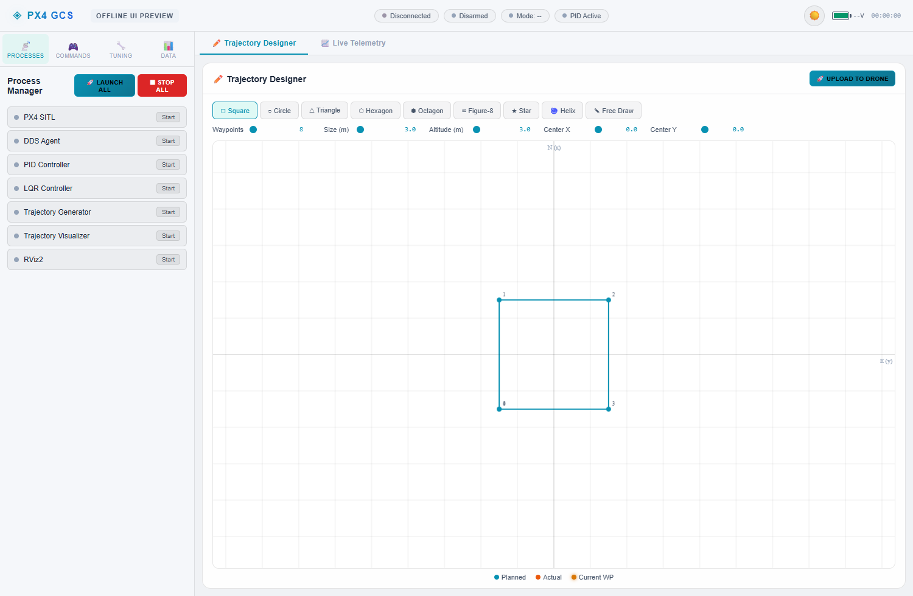
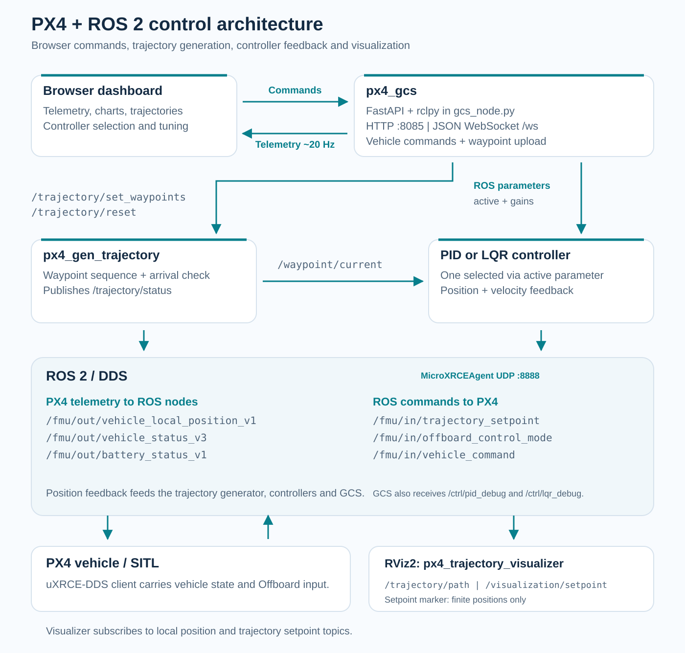

# PX4 ROS 2 Ground Control Station

**A browser dashboard for PX4 simulation, trajectory design, controller tuning and RViz2 visualization.**

ROS 2 Humble · PX4 SITL / Gazebo · C++17 / Python · FastAPI / WebSocket · RViz2

<a id="english"></a>

**English** · [Tiếng Việt](#tieng-viet)

This project brings a PX4 simulation workflow into one web interface: start the simulation stack, inspect vehicle telemetry, select PID or LQR control, and upload a sequence of flight waypoints. ROS 2 connects the interface, trajectory generator, controllers and visualization node to PX4 through uXRCE-DDS.



*The existing web frontend rendered offline, with processes stopped and no vehicle connected. The square is a locally generated trajectory preview, not recorded flight data.*

[Features](#features) · [Architecture](#architecture) · [Setup](#setup) · [Run](#run) · [Interfaces](#interfaces) · [Troubleshooting](#troubleshooting) · [Credits](#credits)

<a id="features"></a>

## Features

| Area | What the repository implements |
|---|---|
| Process manager | Start/stop PX4 SITL, the DDS agent, PID/LQR nodes, trajectory generator, visualizer and RViz2 |
| Trajectory designer | Square, circle, triangle, hexagon, octagon, figure-eight, star, helix and free-draw paths |
| Waypoint upload | Send NED coordinates to the trajectory generator and reset its waypoint index |
| Flight commands | ARM, DISARM, OFFBOARD, LAND and RTL command requests |
| Controller selection | Switch PID/LQR activity through ROS parameters |
| Tuning interface | PID gains and LQR Q/R settings exposed through parameter requests |
| Telemetry | Position, velocity, battery, navigation/arming state, controller debug and waypoint progress |
| Browser plots | Position, error, acceleration command and XY path views; CSV export of the rolling buffer |
| RViz2 | Actual path and `map -> base_link` TF; markers for finite position setpoints |

The interface is intended for the repository's **SITL workflow**. Once local-position feedback arrives, an active controller sends ARM and OFFBOARD requests automatically. PID starts active; LQR starts inactive. The initial position target is **NED `(0, 0, -3)`**, approximately 3 m above the local origin.

<a id="architecture"></a>

## Architecture



The browser exchanges JSON with `px4_gcs` over WebSocket `/ws`. The Python node forwards vehicle commands and waypoints into ROS 2, reads telemetry, and broadcasts it to the browser at a configured **20 Hz**. PID and LQR also use configured **50 ms wall timers**; trajectory status is published every **500 ms**.

These are configured rates, not measured timing or performance benchmarks.

### Repository layout

```text
PX4-ROS2-Ground-Control/
├── README.md
├── setup_env.sh                         # Environment installation helper
├── Documents/                          # Installation and interface guides
├── docs/images/                        # README preview and architecture
└── src/
    ├── px4_gcs/                        # Python ROS node + FastAPI + web UI
    ├── px4_gen_trajectory/              # Waypoint sequence and arrival checks
    ├── px4_position_controller/         # PID position/velocity feedback
    ├── px4_lqr_controller/              # LQR feedback controller
    ├── px4_trajectory_visualizer/       # Path, TF and setpoint visualization
    └── px4_test_bridge/                 # Basic communication experiments
```

`px4_msgs` is an **external dependency** and is not included in this checkout. Add its compatible source under `src/px4_msgs` before building.

<a id="setup"></a>

## Setup

### Dependencies

| Dependency | Purpose |
|---|---|
| Ubuntu 22.04 / WSL2 Ubuntu | Documented development environment |
| ROS 2 Humble and RViz2 | ROS nodes, interfaces and visualization |
| PX4-Autopilot with Gazebo support | `make px4_sitl gz_x500` simulation |
| Micro XRCE-DDS Agent | `MicroXRCEAgent udp4 -p 8888` |
| Compatible `px4_msgs` | PX4 message definitions used by the C++ and Python nodes |
| C++17, Eigen3, colcon and rosdep | Build the workspace |
| FastAPI, Uvicorn and WebSockets | Serve the browser interface |

Follow the upstream [ROS 2 Humble installation guide](https://docs.ros.org/en/humble/Installation/Ubuntu-Install-Debs.html), [PX4 ROS 2 guide](https://docs.px4.io/main/en/ros2/user_guide) and [uXRCE-DDS guide](https://docs.px4.io/main/en/middleware/uxrce_dds) to prepare the external stack. Match the PX4 checkout, agent and message definitions rather than assuming any latest release is compatible.

The code subscribes to versioned topics including `/fmu/out/vehicle_local_position_v1` and `/fmu/out/vehicle_status_v3`. Verify that your PX4 setup actually publishes these names and that its message definitions match the ROS workspace.

### Workspace paths

The current process manager uses these paths:

| Resource | Expected location |
|---|---|
| ROS workspace | `~/ros2_px4_ws` |
| PX4 checkout | `~/PX4-Autopilot` |
| RViz configuration | `~/ros2_px4_ws/src/px4_trajectory_visualizer/rviz/trajectory.rviz` |

For the existing **Launch All** behavior, clone the repository itself as the workspace root:

```bash
git clone https://github.com/TuanLinh05/PX4-ROS2-Ground-Control.git ~/ros2_px4_ws
cd ~/ros2_px4_ws

# External message definitions: select a revision compatible with your PX4.
git clone https://github.com/PX4/px4_msgs.git src/px4_msgs
```

If your PX4 checkout uses a release branch or a custom message revision, select the corresponding `px4_msgs` revision before the next step. For a different workspace location, update the paths in [`process_manager.py`](src/px4_gcs/px4_gcs/process_manager.py) or use the manual startup commands below.

### Install workspace dependencies and build

With ROS 2 installed and its repositories configured:

```bash
source /opt/ros/humble/setup.bash
sudo apt install build-essential libeigen3-dev python3-pip \
  python3-colcon-common-extensions python3-rosdep
python3 -m pip install fastapi 'uvicorn[standard]' websockets
```

Initialize `rosdep` with `sudo rosdep init` only if this machine has never been initialized. Then:

```bash
rosdep update
cd ~/ros2_px4_ws
rosdep install --from-paths src --ignore-src --rosdistro humble -y
colcon build --symlink-install
source install/setup.bash
```

[`setup_env.sh`](setup_env.sh) automates parts of the ROS/PX4/agent installation on Ubuntu. It installs system packages, builds external projects and edits `.bashrc`; it does not add `px4_msgs` or pin a tested combination of external revisions. Review it alongside the current upstream installation instructions.

<a id="run"></a>

## Run the GCS

### Browser-managed startup

From a terminal with the workspace built:

```bash
source /opt/ros/humble/setup.bash
cd ~/ros2_px4_ws
source install/setup.bash
ros2 run px4_gcs gcs_node
```

Open [http://localhost:8085](http://localhost:8085), then use **Processes -> Launch All**. The manager starts PX4, waits for startup output, starts the DDS agent and ROS nodes, and opens RViz2.

The launch sequence has several built-in delays, so process rows appear gradually. Check the process logs and vehicle telemetry before uploading a path. A browser **Connected** indicator confirms the WebSocket connection to the GCS server; it does not establish that PX4 feedback is fresh.

> **SITL startup effects:** Launch All cleans up processes named `px4`, `ruby` and `gz`, and sends `COM_RCL_EXCEPT=4`, `NAV_RCL_ACT=0` and `NAV_DLL_ACT=0` to its PX4 shell. Active controllers request ARM at tick 40 and OFFBOARD at tick 50 after receiving state. Use this automation for an isolated simulation session.

The server binds `0.0.0.0:8085` and the WebSocket command endpoint has no authentication layer in the current implementation. Keep the control interface within the intended trusted simulation environment.

### Manual startup

For custom paths or closer inspection, start the components separately. First:

```bash
# Terminal 1: PX4 checkout
cd ~/PX4-Autopilot
make px4_sitl gz_x500
```

```bash
# Terminal 2: DDS agent
MicroXRCEAgent udp4 -p 8888
```

In each following terminal, source ROS 2 and the workspace first:

```bash
source /opt/ros/humble/setup.bash
source ~/ros2_px4_ws/install/setup.bash
```

Run each component in its own terminal:

```bash
ros2 run px4_gen_trajectory gen_trajectory_node
ros2 run px4_position_controller position_controller_node
ros2 run px4_lqr_controller lqr_controller_node --ros-args -p active:=false
ros2 run px4_trajectory_visualizer trajectory_visualizer_node
rviz2 -d ~/ros2_px4_ws/src/px4_trajectory_visualizer/rviz/trajectory.rviz
ros2 run px4_gcs gcs_node
```

Use **Launch All** only for browser-managed startup. Manual processes run outside the manager's tracked process rows. Its cleanup commands can also affect a manually started simulation.

### Design and upload a trajectory

1. Select a preset or **Free Draw** in **Trajectory Designer**.
2. Adjust waypoint count, size, altitude and center coordinates.
3. Inspect the planned path, then click **Upload to Drone**.
4. Watch waypoint progress and the actual path; use **RESET TRAJ** to restart from the first waypoint.

Waypoints use **NED** coordinates: `x = North`, `y = East`, `z = Down`. A positive altitude in the UI becomes a negative NED `z`. The trajectory generator starts with `(0, 0, -3)` and advances when the distance to a waypoint is below `arrive_distance`, default **0.4 m**. At the end, the controller retains its last target.

For CSV export, select **Data -> Export CSV**. The browser keeps a rolling buffer of **600 samples**, about 30 seconds at the configured 20 Hz stream; export saves that buffer, not a complete flight recording.

<a id="interfaces"></a>

## ROS interfaces

| Topic | Role |
|---|---|
| `/fmu/out/vehicle_local_position_v1` | PX4 position/velocity feedback |
| `/fmu/out/vehicle_status_v3` | PX4 arming, navigation and failsafe state |
| `/fmu/out/battery_status_v1` | Battery telemetry |
| `/fmu/in/vehicle_command` | ARM, DISARM, mode, LAND and RTL requests |
| `/fmu/in/offboard_control_mode` | Offboard control heartbeat |
| `/fmu/in/trajectory_setpoint` | Controller acceleration setpoints |
| `/trajectory/set_waypoints` | Flat `Float64MultiArray`: `[x1,y1,z1,x2,y2,z2,...]` |
| `/waypoint/current` | Current target as `geometry_msgs/msg/PointStamped` |
| `/trajectory/reset` | Reset request as `std_msgs/msg/Bool` |
| `/trajectory/status` | Current index, total count, target and completion state |
| `/ctrl/pid_debug`, `/ctrl/lqr_debug` | Controller diagnostics |
| `/trajectory/path` | Actual ENU path for RViz2 |
| `/visualization/setpoint` | Marker when a finite position setpoint is received |

The controllers select activity through the `active` parameter. GUI tuning sends parameter requests to `/position_controller_node/set_parameters` or `/lqr_controller_node/set_parameters`.

### Current implementation notes

- RViz uses ENU (`x=East`, `y=North`, `z=Up`) with frame `map`; the visualizer converts PX4 NED coordinates and broadcasts `base_link`.
- The PID/LQR route publishes acceleration setpoints with position fields set to NaN. The visualizer's finite-position check can therefore leave the setpoint marker absent in this route. The waypoint-marker publisher is declared but not populated by the current node.
- The browser has a **Compare PID vs LQR** selector, but retained debug samples and frontend debug selection do not constitute a controlled performance comparison.
- LQR's parameter callback creates a temporary timer for gain recomputation. Verify the resulting gain in node logs; starting the controller with explicit Q/R parameters gives a clearer initial configuration.

<a id="troubleshooting"></a>

## Troubleshooting

| Symptom | Check |
|---|---|
| Build cannot find `px4_msgs` | Add compatible message sources to `src/px4_msgs`, then rebuild |
| Web node fails to import FastAPI/Uvicorn | Install the Python dependencies for the interpreter used by the ROS package |
| Launch All cannot find a workspace or RViz file | Use `~/ros2_px4_ws` or adapt the paths in `process_manager.py` |
| No vehicle telemetry | Verify the DDS agent, UDP `8888`, PX4 topic names and message compatibility |
| Browser connected but values remain unchanged | Check ROS feedback separately; WebSocket status only describes browser/server connectivity |
| Controller does not produce commands | Check `/fmu/out/vehicle_local_position_v1` and its `active` parameter |
| RViz path absent | Run the visualizer, select fixed frame `map`, and check `/trajectory/path` |
| RViz setpoint marker absent | Acceleration-only controller messages do not contain finite position targets |
| No charts or missing fonts | The frontend loads Plotly and fonts from CDNs; check internet access |
| Old processes interfere with startup | Inspect your simulation sessions before using the manager's cleanup |

<a id="credits"></a>

## Documentation and credits

- [New-machine setup notes](Documents/INSTALL_NEW_MACHINE.md)
- [Vietnamese GCS usage guide](Documents/huong_dan_su_dung_gcs.md)
- [Trajectory generator](src/px4_gen_trajectory/README.md)
- [PID controller](src/px4_position_controller/README.md)
- [RViz visualizer](src/px4_trajectory_visualizer/README.md)

Some package notes describe earlier behavior; the current source and paths summarized here should guide startup.

**TuanLinh05** developed the web interface (`px4_gcs`) and RViz visualization module (`px4_trajectory_visualizer`), and adapted the trajectory generator for the GUI workflow. The original PID/LQR control backend and communication-test code retain credit to their original author, as noted in the existing project documentation.

Built on [PX4 Autopilot](https://github.com/PX4/PX4-Autopilot), [ROS 2](https://www.ros.org/), [Micro XRCE-DDS](https://github.com/eProsima/Micro-XRCE-DDS-Agent), FastAPI, Plotly and RViz2.

*Project 1 / Đồ án 1 - HK252.*

---

<a id="tieng-viet"></a>

## Tiếng Việt

[English](#english) · **Tiếng Việt**

### Giới thiệu

Hệ thống **Ground Control Station cho PX4 SITL/Gazebo trên ROS 2** giúp quản lý các tiến trình mô phỏng, xem telemetry, chọn PID/LQR, điều chỉnh tham số và thiết kế quỹ đạo trên trình duyệt. RViz2 hiển thị đường bay thực tế và hệ tọa độ của drone.

Ảnh đầu README được chụp từ giao diện HTML/CSS có sẵn ở trạng thái offline. Các tiến trình đang dừng và hình vuông là quỹ đạo preview, chưa phải dữ liệu bay. Sơ đồ kiến trúc được dựng theo các node/topic trong mã nguồn.

### Cài đặt và build

Môi trường tài liệu sử dụng **Ubuntu 22.04 hoặc WSL2 Ubuntu, ROS 2 Humble, PX4 có Gazebo, Micro XRCE-DDS Agent, Eigen3 và thư viện web Python**. `px4_msgs` chưa được kèm trong repo, cần lấy từ PX4 và chọn revision tương thích với autopilot.

Process manager hiện dùng đường dẫn cố định `~/ros2_px4_ws` và `~/PX4-Autopilot`. Để dùng Launch All theo cấu hình hiện tại:

```bash
git clone https://github.com/TuanLinh05/PX4-ROS2-Ground-Control.git ~/ros2_px4_ws
cd ~/ros2_px4_ws
git clone https://github.com/PX4/px4_msgs.git src/px4_msgs
```

Chọn revision `px4_msgs` khớp với PX4 trước khi build. Sau khi đã cài ROS 2:

```bash
source /opt/ros/humble/setup.bash
sudo apt install build-essential libeigen3-dev python3-pip \
  python3-colcon-common-extensions python3-rosdep
python3 -m pip install fastapi 'uvicorn[standard]' websockets
```

Nếu chưa khởi tạo `rosdep` trên máy, chạy `sudo rosdep init` một lần. Sau đó:

```bash
rosdep update
cd ~/ros2_px4_ws
rosdep install --from-paths src --ignore-src --rosdistro humble -y
colcon build --symlink-install
source install/setup.bash
ros2 run px4_gcs gcs_node
```

Mở [http://localhost:8085](http://localhost:8085), vào **Processes -> Launch All**. PX4, DDS Agent, hai controller, generator, visualizer và RViz2 sẽ được mở theo thứ tự có độ trễ. Nếu dùng workspace khác, sửa đường dẫn trong [process manager](src/px4_gcs/px4_gcs/process_manager.py) hoặc chạy [thủ công](#run).

**Hành vi cần biết:** controller active gửi yêu cầu ARM tại tick 40 và OFFBOARD tại tick 50 sau khi có feedback. PID active mặc định, LQR inactive; target đầu là NED `(0,0,-3)`. Launch All còn dọn process `px4`, `ruby`, `gz` và gửi các parameter `COM_RCL_EXCEPT=4`, `NAV_RCL_ACT=0`, `NAV_DLL_ACT=0`. Dùng cơ chế này trong phiên SITL riêng.

GCS bind `0.0.0.0:8085`, chưa có lớp xác thực cho WebSocket điều khiển. Chỉ mở giao diện trong môi trường mô phỏng đáng tin cậy. Trạng thái **Connected** phản ánh kết nối trình duyệt tới server, chưa xác nhận telemetry PX4 còn mới.

### Thiết kế quỹ đạo và xem dữ liệu

1. Chọn hình có sẵn hoặc **Free Draw**.
2. Đặt số waypoint, kích thước, độ cao và tâm quỹ đạo.
3. Xem preview rồi bấm **Upload to Drone**.
4. Theo dõi waypoint và đường bay; **RESET TRAJ** đưa index về waypoint đầu.

Tọa độ waypoint là **NED**: X Bắc, Y Đông, Z hướng xuống. Độ cao dương trong GUI được đổi thành Z âm. Generator mặc định giữ target `(0,0,-3)`, đổi waypoint khi khoảng cách dưới `0.4 m`; sau waypoint cuối, controller giữ target cuối.

WebSocket và timer controller được cấu hình **20 Hz**, status quỹ đạo **2 Hz**. Đây là tốc độ cấu hình, chưa phải benchmark. **Data -> Export CSV** lưu buffer trình duyệt tối đa 600 mẫu, khoảng 30 giây ở 20 Hz.

RViz chuyển NED sang ENU và dùng fixed frame `map`. Controller hiện xuất acceleration với position NaN nên marker setpoint có thể không xuất hiện; marker waypoint mới được khai báo publisher. Selector so sánh PID/LQR và biểu đồ debug cần được kiểm tra theo dữ liệu thực, chưa thể coi là đánh giá hiệu năng có kiểm soát.

### Xử lý lỗi và tài liệu

| Vấn đề | Hướng kiểm tra |
|---|---|
| Thiếu `px4_msgs` khi build | Thêm source tương thích vào `src/px4_msgs` |
| Launch All không tìm thấy workspace | Kiểm tra `~/ros2_px4_ws` và đường dẫn RViz |
| Không có telemetry | Kiểm tra agent, UDP `8888`, topic version và revision messages |
| Web báo Connected nhưng số liệu đứng | Kiểm tra feedback ROS riêng với kết nối WebSocket |
| Không thấy đường bay RViz | Chạy visualizer, dùng frame `map`, kiểm tra `/trajectory/path` |
| Không có chart | Plotly/font được tải từ CDN, cần kết nối mạng |

Xem [bảng topic](#interfaces), [hướng dẫn GCS](Documents/huong_dan_su_dung_gcs.md) và [cài máy mới](Documents/INSTALL_NEW_MACHINE.md). Hướng dẫn cũ có thể mô tả các phiên bản trước; dùng đường dẫn và hành vi hiện tại trong README này.

**TuanLinh05** phát triển GUI web và module RViz, đồng thời điều chỉnh generator cho luồng GUI. Core điều khiển PID/LQR và code test giao tiếp gốc vẫn được ghi nhận cho tác giả nguyên bản.

*Đồ án 1 - HK252.*
